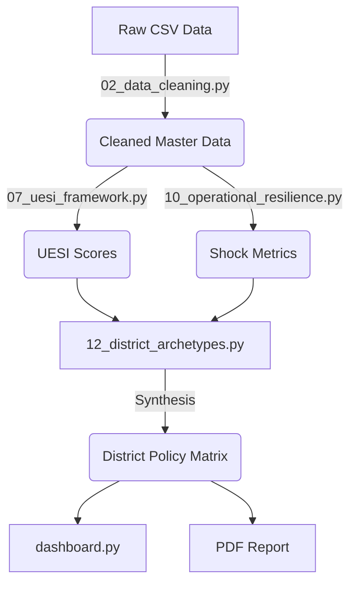

# 🤖 AGENT.md: Execution Log & Scope Definition

**Aadhaar Lifecycle Stress & Compliance Risk (ALSCR) Framework**

---

## 🎯 AGENT ROLE & PIVOT

This document records the operational constraints and strategic shifts undertaken by the **Antigravity Agent** during the project lifecycle.

### Major Strategic Pivot (Phase 3)

- **Initial Plan**: Focus on "Mandatory Update Compliance Gap (MUCG)" and "ALVI".
- **Discovery**: EDA revealed that _Operational Volatility_ was a more urgent and "invisible" problem than compliance gaps.
- **Strategic Shift**: Deprioritized MUCG to build the **Operational Resilience Framework**.
- **Outcome**: A stronger, unique narrative around "Shock Intensity" that distinguishes this submission from standard compliance reports.

---

## 🚀 DELIVERED SCOPE

The Agent has successfully delivered the following **In-Scope** components:

### 1. 🏗️ The ALSCR Analytical Pipeline

- **Data Cleaning Audit**: Automated auditing of 3 raw datasets, removing ~5% noise (duplicates, logging errors).
- **UESI Engine**: A normalized index (0-100) quantifying "Citizen Pain" via update re-work ratios.
- **Resilience Modeler**: A statistical engine measuring daily volume shocks (`Peak/Median`) and volatility (`Coeff of Var`).

### 2. 📱 Interactive Decision Support System

- **Streamlit Dashboard**: `dashboard.py`
  - _Real-time Filtering_: Navigate 700+ districts instantly.
  - _Visualizations_: Embedded Heatmaps and Scatter plots.
  - _Safe-to-Run_: Runs locally without external API dependencies.

### 3. 📄 Policy-Grade Reporting

- **Automated PDF Generation**: `scripts/generate_pdf.py` using `xhtml2pdf`.
- **Ethical Language Framework**:
  - Replaced "Failure/Broken" with "Stress/Friction".
  - Replaced "Prediction" with "Early Warning".
- **Visual Storytelling**: Generated 6 high-impact figures including the "Resilience Map" (Figure 6.2).

---

## 🧠 CORE PRINCIPLES ADHERED TO

1.  **Pipeline First**: No manual Excel work; every number in the PDF is generated by `notebooks/`.
2.  **Aggregated Data Only**: Analysis remained strictly at the `District-Day` level. No PII was touched.
3.  **Reproducibility**: The repository includes a `requirements.txt` and sequential scripts to rebuild all results from zero.
4.  **Governance Focused**: The final output is not just code, but a **Policy Matrix** (The 4 Archetypes) usable by bureaucrats.

---

## 🛠️ TECHNICAL ARCHITECTURE (FINAL)

---

## 🏁 DEFINITION OF DONE (MET)

- [x] **Pipeline**: Runs end-to-end without errors.
- [x] **Dashboard**: Functional interactive UI.
- [x] **Report**: 10-section PDF with Appendices.
- [x] **Documentation**: Clear `README.md` and `AGENT.md`.

**Status**: **PROJECT COMPLETE** | **READY FOR SUBMISSION**
